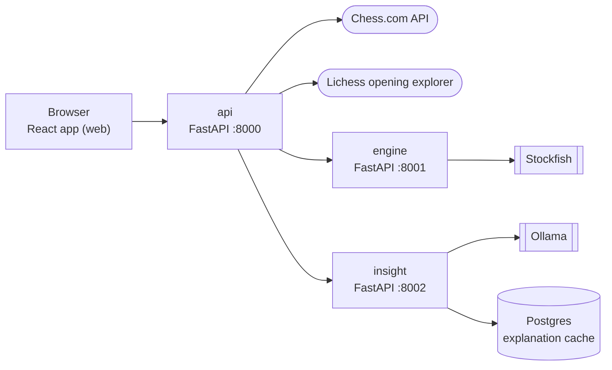

# OffBook

OffBook reviews your latest Chess.com game. It shows where you left opening theory,
the mistakes and blunders of both players, and a short AI explanation of each one.

## Architecture



| Service | What it does |
|---|---|
| web | React UI. It only talks to `api`. |
| api | The public entry point. It gets the game, finds where it left opening theory, and sends work to `engine` and `insight`. |
| engine | Finds mistakes and blunders with a fixed pool of Stockfish processes. |
| insight | Writes explanations with Ollama and saves them in Postgres. |

## Project structure

- `offbook/` has the Python services: `api`, `engine` and `insight`.
- `web/` has the React app.
- `k8s/` has the Kubernetes files, one file for each service.
- `tests/` has the Python tests.

## Run with Docker

```
echo "LICHESS_TOKEN=<your token>" > .env
docker compose up --build
```

Then open <http://localhost:8080>.

The first start downloads the model `llama3.2:1b`, which is about 1.3 GB.

- For better explanations, use a bigger model: `OLLAMA_MODEL=llama3.1:8b docker compose up`
- To use the Ollama on your own machine: `OLLAMA_BASE_URL=http://host.docker.internal:11434 docker compose up`

## Run on Kubernetes

The images are on Docker Hub: `vector94/offbook` for api, engine and insight, and
`vector94/offbook-web` for the web app. On a local cluster, like the one in Docker Desktop:

```
echo "LICHESS_TOKEN=<your token>" > .env
kubectl create secret generic offbook --from-env-file=.env
kubectl apply -f k8s/
```

Then open <http://localhost:8080>.

The first start downloads the model `llama3.2:1b` into the ollama volume. Explanations
work when the `ollama-pull` job is finished.

Useful commands:

```
kubectl get pods
kubectl get job ollama-pull
kubectl logs deployment/api
kubectl scale deployment/engine --replicas=3
kubectl delete -f k8s/
```

## Run without Docker

You need:

- Python 3.12 with [uv](https://docs.astral.sh/uv/), and Node.js
- Postgres
- [Ollama](https://ollama.com) with a model, for example `ollama pull llama3.1:8b`
- Stockfish, for example `brew install stockfish`
- A [Lichess API token](https://lichess.org/account/oauth/token)

```
uv sync
echo "LICHESS_TOKEN=<your token>" > .env
createdb offbook_insight_dev

uv run uvicorn offbook.api.main:app --port 8000
uv run uvicorn offbook.engine.main:app --port 8001
uv run uvicorn offbook.insight.main:app --port 8002
cd web && npm install && npm run dev
```

Run each service in its own terminal, then open <http://localhost:5173>.

## Configuration

Settings come from environment variables or `.env`. The defaults work for local development.
The ones you will most likely change:

| Variable | Default |
|---|---|
| `LICHESS_TOKEN` | required |
| `ENGINE_SERVICE_URL` | `http://localhost:8001` |
| `INSIGHT_SERVICE_URL` | `http://localhost:8002` |
| `STOCKFISH_PATH` | `stockfish` |
| `ENGINE_WORKERS` | `2` |
| `INSIGHT_DATABASE_URL` | `postgresql://localhost/offbook_insight_dev` |
| `OLLAMA_BASE_URL` | `http://localhost:11434` |
| `OLLAMA_MODEL` | `llama3.1:8b` |
| `CORS_ORIGINS` | `*` |

Docker and Kubernetes set `OLLAMA_MODEL` to the smaller `llama3.2:1b`. Any Ollama model works.

All settings are in `offbook/config.py`, `offbook/engine/config.py` and `offbook/insight/config.py`.

## Tests

```
uv run pytest
```
