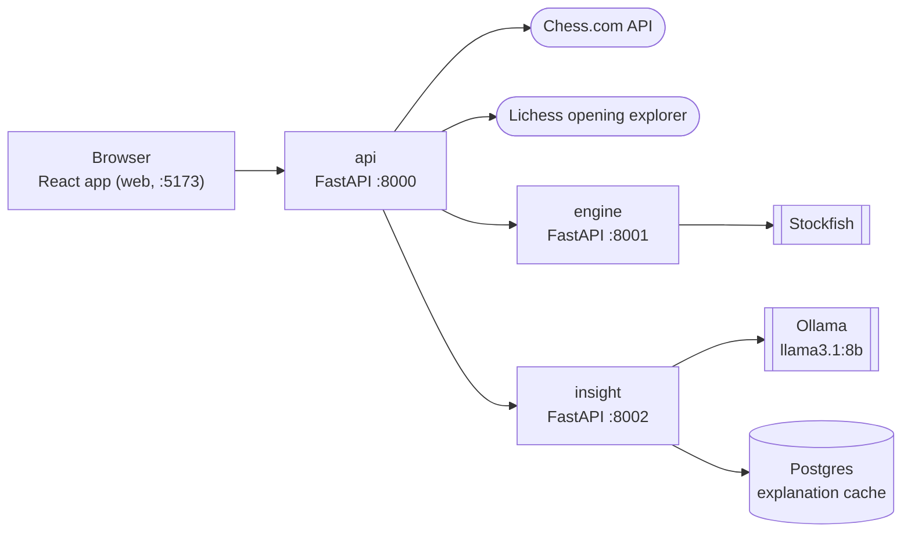

# OffBook

Review your latest Chess.com game: see where you left opening theory, which moves were
mistakes or blunders (for both players), and a short AI explanation of each.

## Architecture



| Service | What it does |
|---|---|
| web | React UI; only talks to `api` |
| api | Public entry point: fetches the game, finds where it left opening theory, forwards analysis to `engine` and explanations to `insight` |
| engine | Runs Stockfish analysis with a fixed pool of engine processes |
| insight | Generates explanations with Ollama and caches them in Postgres |

## Prerequisites

- Python 3.12 with [uv](https://docs.astral.sh/uv/), and Node.js
- Postgres
- [Ollama](https://ollama.com) with `llama3.1:8b` pulled
- Stockfish (`brew install stockfish`)
- A [Lichess API token](https://lichess.org/account/oauth/token)

## Run

```
uv sync
echo "LICHESS_TOKEN=<your token>" > .env
createdb offbook_insight_dev

uv run uvicorn offbook.api.main:app --port 8000
uv run uvicorn offbook.engine.main:app --port 8001
uv run uvicorn offbook.insight.main:app --port 8002
cd web && npm install && npm run dev
```

Run each service in its own terminal, then open <http://localhost:5173>.

## Configuration

Settings come from environment variables or `.env`; the defaults work for local development.
The ones you are most likely to change:

| Variable | Default |
|---|---|
| `LICHESS_TOKEN` | required |
| `ENGINE_SERVICE_URL` / `INSIGHT_SERVICE_URL` | `http://localhost:8001` / `http://localhost:8002` |
| `STOCKFISH_PATH` | `stockfish` |
| `ENGINE_WORKERS` | `2` |
| `INSIGHT_DATABASE_URL` | `postgresql://localhost/offbook_insight_dev` |
| `OLLAMA_BASE_URL` / `OLLAMA_MODEL` | `http://localhost:11434` / `llama3.1:8b` |
| `CORS_ORIGINS` | `*` |

All settings are in `offbook/config.py`, `offbook/engine/config.py` and `offbook/insight/config.py`.

## Tests

```
uv run pytest
```
